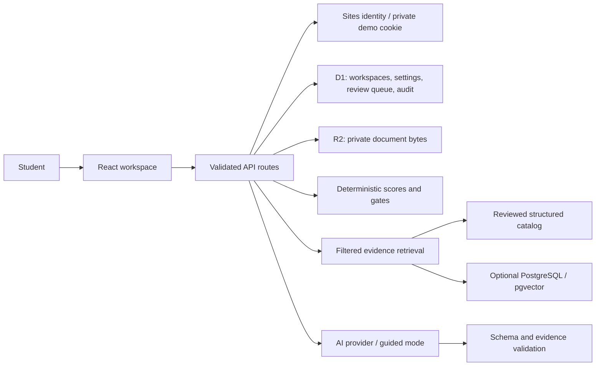

# Architecture

ConsultAI is a modular monolith. App Router pages render a responsive client workspace; all durable writes, identity, authorization and AI calls live in API route handlers. A typed matching engine is shared with server guidance and the simulator.

## Persistence

`db/schema.ts` defines workspaces, documents, source versions, admin audit, rate-limit buckets and settings. Initial schema lives in `drizzle/0000_youthful_magik.sql`. Workspace state is a bounded validated aggregate of profile, shortlist, comparisons, messages, applications, tasks and profile report snapshots. It is intentionally not a fully normalized enterprise CRM schema.

Document metadata is indexed by owner; bytes use owner-prefixed private R2 object keys. Download and deletion endpoints query by both record ID and owner. Source versions are append-only captures; explicit review transitions update status and write an audit record. Catalog and weights are server-validated settings.

`prisma/schema.prisma` describes the optional PostgreSQL source/document/chunk index. Its SQL migration adds pgvector and an HNSW cosine index. Neon HTTP transport avoids unsupported raw TCP in the hosted Worker. The Prisma CLI owns external index schema validation/migration; vector queries use parameterized SQL because the vector type is represented as `Unsupported` in Prisma.

## Matching model

Default weights: academics 30, budget 25, language 15, exact field/degree 15, scholarship opportunity 10, preference 5. Weights must total 100. Academic percentage is a profile-strength proxy, not a conversion of FSc into another qualification. Unknown language criteria receive explicitly explained partial points. Scholarships are an opportunity indicator only, with no assumed financial award. Budget uses first-year scenario costs.

IELTS overall/components, German evidence, the FSc entrance pathway and field/degree mismatch produce gates regardless of numerical score. Unknown equivalence and intake policy remain `Needs Verification`. Country ranking takes the highest-scoring stored program in that country; it is not a comprehensive country-wide statistical ranking.

## Scaling boundaries

Catalog limit 200 programs/sources, 100 retained chat messages, 30 report snapshots and bounded uploaded text. Owner indexes and atomic rate-limit increments keep ordinary reads small. Large-catalog server pagination, normalized application tables, background ingestion jobs and multi-tenant consultancy membership are future work.
